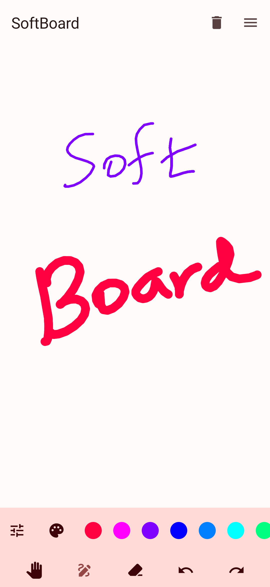

  
  <h1 align="center">SoftBoard</h1>
  <b>SoftBoard</b> is a simple whiteboard app for android.

 

 

    
    
    
    
    
     

---

  
  Screenshots

  

## Features
- Infinite canvas
- Color Picker
- Supports multiple brush sizes
- Export Drawing as PNG or JPEG

## Installation

